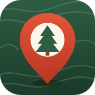

# Kjentmann

Din egen kartbok over gode plasser: fiskekulper, kantarellbakker, multemyrer, teltplasser og alt annet du vil finne igjen.

**Åpne appen:** https://khalm.github.io/kjentmann/

## Dette kan den

- **📍 Her jeg står** – lagrer plassen du er på akkurat nå (venter på god GPS-nøyaktighet).
- **➕ Punkt** – merk hvor som helst i kartet, ved å trykke eller sikte med krysset.
- **⬠ Område** – trykk ut hjørnene, eller **gå rundt området** med telefonen. Viser størrelsen i m², dekar eller km².
- Velg **hva det er** (fiske, sopp, bær, jakt, telt, bål, bading, utsikt, vann, parkering, annet), **ikon**, **farge** og skriv **notater**.
- **📤 Del** én plass eller mange som en lenke. Mottakeren ser plassene på kartet og kan lagre dem.
- **Mine plasser** – liste med søk, filter på type og avstand fra der du står.
- **🧭 Veibeskrivelse** til plassen.
- **Kartlag:** Kartverkets topografiske kart (stier, vann, høydekurver), gråtone, flyfoto og OpenStreetMap.
- **Virker uten dekning:** appen og kartbiter du har sett lagres på telefonen, og du kan laste ned kart for et helt område på forhånd.
- **Sikkerhetskopi** til fil, og hent tilbake.

Alt er gratis. Ingen konto, ingen server, ingen reklame. Plassene lagres bare på telefonen din.

## Installer på telefonen

- **Android (Chrome):** åpne lenken → meny ⋮ → *Legg til på startskjermen* / *Installer app*.
- **iPhone (Safari):** åpne lenken → Del-knappen → *Legg til på Hjem-skjerm*.

## Oppsett av GitHub Pages (én gang)

Repoet → **Settings** → **Pages** → under *Build and deployment*, velg **Source: GitHub Actions**.
Deretter publiseres appen automatisk hver gang noe endres på `main`.

## Teknisk

Ren HTML/CSS/JavaScript uten byggesteg. Kart med [Leaflet](https://leafletjs.com/). Service worker (`sw.js`) for bruk uten nett.
Versjonsnummeret står i `APP_VERSION` i `app.js` og `VERSION` i `sw.js` – oppdater begge ved ny versjon.
